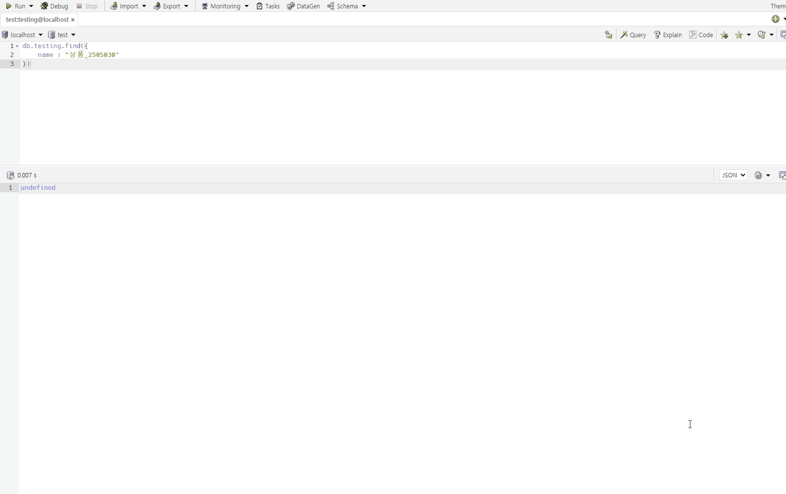
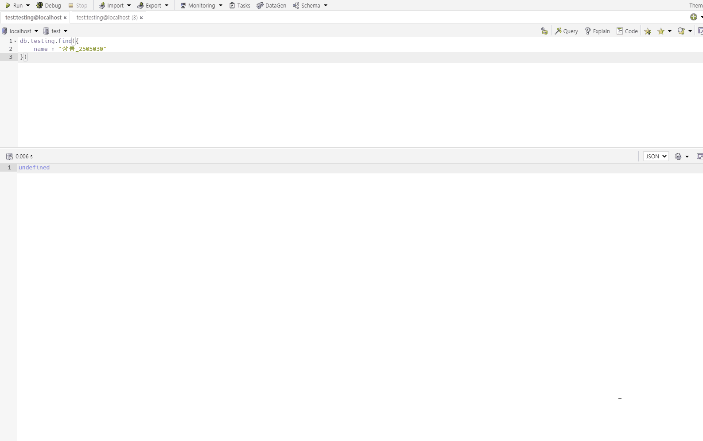

# Mongodb 인덱스

## 계기

데이터를 수집한 뒤 해당 데이터들을 확인하기 위해 집계(Aggregation)을 사용하고있었다.  
몇 개의 데이터로는 상관이 없었지만 데이터가 조금이라도 많아지는 순간 웹 페이지에서 데이터를 불러오는 속도가 눈에 띄게 느리다는 것을 확인했다.
그래서 속도를 조금이나마 올릴 수 없을까? 생각하는 중 `인덱스`를 기억하게 되었고 이번 기회에 확실히 공부하려고 한다.

## 인덱스

인덱스? 인덱스는 무엇을 의미할까?   
사전적 의미는 다음과 같다.
> · 네이버 사전 참고  
> 인덱스(index) : 색인, 색인을 만들다, 물가와 연동시키다.  
> 색인(index) : 색인 또는 목록이라는 의미이며, 데이터를 기록할 경우 그 데이터의 이름, 데이터 크기 등의 속성과 그 기록 장소 등을 표로 표시하는 것

<div style="text-align: center">
  
  <h6 style="text-align: center">여렵게 느낄 필요 없이 책의 목록, 목차를 확인하면 된다.</h6> 
</div>


## 속도 차이

```text
* test 환경
- Mongodb : 5.0v 
- 데이터 건수 : 3000000
- 데이터 형식
    document : {
        code : number
        name : String
    }
- 예시
    {
        code : 1
        name : 상품_1
    },
    {
        code : 2
        name : 상품_2
    }
```

간단하게 테스트 해본 인덱스 유무의 차이이다.

|       |                                 |                         |
|:-----:|:-------------------------------:|:-----------------------:|
|  검색   |  |  |
|  인덱스  |                X                |            O            |
| 시간(s) |              1.610              |          0.008          |

---

## 시작하기 전

인덱싱을 이해하기 위해서는 적절한 예시가 필요했고, `모든 요리 방법`이 담겨있는 `요리책`을 상상하며 공부했습니다.
> 요리의 모든 것! [필자가 앞으로 사용할 모든 요리 방법이 담긴 책의 이름입니다.]

## 단순 인덱스

만들고 싶은 요리 방법을 찾기위해 다양한 방법이 있겠지만. 가장 좋은 방법은 요리법의 이름으로 요리를 찾는 것이다.  
요리법의 이름으로 `요리의 모든 것!`을 인덱스한다면 다음과 같은 느낌으로 만들어질 것이라 상상이 가능합니다.

- 가지볶음 : 120.p
- 나시고렝 : 180.p
- 달고나   : 200.p 
- 제육볶음 : 560.p
....

음식의 이름이 표기되고 그 뒤로 해당 음식의 요리 방법이 담겨있는 책의 페이지를 나타낸다.  
만약 우리가 `제육볶음`이 먹고싶어서 음식을 찾는다면 책의 560 페이지를 펼쳐보면 되는 것. 


## 인덱스 관리를 위한 실용적인 조언

## 복잡한 쿼리에 대한 복합 인덱스 사용

## 쿼리 최적화

## 모든 MongoDB 인덱싱 옵션

## 잘못된 인덱스

잘못된 인덱스 방법은 다음과 같은 문제를 발생시킨다.

- 쿼리의 처리가 느려진다.
- 하드웨어를 효율적으로 사용하지 못하게 된다.

## 참고

[MongoDB in Action](https://www.aladin.co.kr/shop/wproduct.aspx?ItemId=144346346)